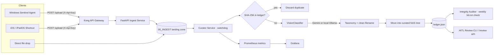

# Synapse Storage System

**An AI-powered, self-hosted document ingestion and curation pipeline for a multi-device NAS.**


Synapse captures files from multiple operating systems and devices, then automatically
**deduplicates, classifies, renames, and files** them into a structured Network Attached
Storage (NAS) taxonomy — with a local-first AI vision classifier, human-in-the-loop
correction, integrity auditing against bit-rot, and full observability.

---

## Why it exists

Files scatter across phones, laptops, and desktops with names like `IMG_4821.jpg` and
`Scan_002.pdf`. Synapse turns a messy, multi-device stream into a single curated archive:
drop a file into the ingest zone (or POST it through the gateway), and the system decides
*what it is*, *where it belongs*, and *what it should be called* — then guarantees it stays
intact over time.

## Architecture



## Features

- **Real-time ingestion** — a `watchdog` polling observer watches the `00_INGEST/` zone,
  with a file-stability wait so partially-written uploads are never processed early, plus a
  periodic sweep to catch anything missed.
- **Content-addressed deduplication** — every file is SHA-256 hashed and checked against a
  persistent `ledger.json`; duplicates are rejected across reboots.
- **AI vision classification** — `VisionClassifier` reads images and PDFs and maps them into a
  fixed taxonomy while generating a clean, descriptive filename. Runs against **Google Gemini**
  or a **local Ollama multimodal model** (privacy-first), with PDF text extraction and a
  heuristic fallback / mock mode when no model is configured.
- **Structured taxonomy** — files are routed into `01_PROFESSIONAL`, `02_TECHNICAL_HOMELAB`,
  `03_PERSONAL`, `04_FINANCIAL`, and `05_SYSTEM` category trees.
- **Integrity auditing (anti bit-rot)** — a scheduled `IntegrityAuditor` re-hashes curated
  files every Sunday at 02:00 and generates a Markdown corruption report on any mismatch or
  missing file.
- **Human-in-the-loop review** — a CLI review tool surfaces the last 20 automated decisions and
  supports re-classification that moves the file and repairs the ledger in one step; also
  exposed via a `/review` API endpoint.
- **Secure ingest gateway** — a FastAPI `/upload` endpoint behind `X-Api-Key` auth, fronted by
  a DB-less **Kong** gateway as the single public entry point.
- **Observability** — `prometheus_client` exports `total_files_ingested`,
  `files_by_source_device`, `ai_categorization_count`, and `nas_storage_usage_percent`,
  visualized in **Grafana**.
- **Cross-platform clients** — a Windows PowerShell "Sentinel" agent that auto-uploads from a
  watched outbox, and an iOS/iPadOS Shortcut blueprint for the native Share Sheet.

## Tech stack

| Layer | Technology |
|-------|-----------|
| Language | Python 3.11 |
| API | FastAPI + Uvicorn |
| Gateway | Kong (DB-less / declarative) |
| Ingestion | watchdog, atomic JSON ledger |
| AI vision | Google Gemini API · local Ollama (multimodal), pypdf, Pillow |
| Config | pydantic-settings, `.env` |
| Observability | prometheus-client, Prometheus, Grafana |
| Scheduling | `schedule` |
| Logging | loguru |
| Tests | pytest, httpx (FastAPI TestClient) |
| Runtime | Docker Compose |

## Project structure

```
synapse-storage-system/
├── src/
│   ├── main.py          # Curator service: watch → dedup → classify → move; scheduler
│   ├── ingest_api.py    # FastAPI: /upload, /review, /metrics (X-Api-Key auth)
│   ├── vision.py        # VisionClassifier: Gemini / Ollama document + image tagging
│   ├── auditor.py       # IntegrityAuditor: SHA-256 bit-rot verification + reports
│   ├── review_tool.py   # Human-in-the-loop CLI review & reclassification
│   ├── models.py        # FileMetadata Pydantic model
│   ├── config.py        # pydantic-settings configuration
│   └── utils.py         # SHA-256 hashing + taxonomy path generation
├── client/              # Windows Sentinel PowerShell agent + client docs
├── config/              # kong.yml, prometheus.yml
├── deploy/              # environment / NAS folder bootstrap
├── docs/                # mobile integration & architecture notes
├── tests/               # pytest unit + API tests
├── scripts/             # test runner
├── docker-compose.yml   # curator, ingest-api, kong, prometheus, grafana, ollama
├── Dockerfile
└── .env.example
```

## Getting started

### Prerequisites
- Docker & Docker Compose
- (Optional) a Google Gemini API key, **or** Ollama for fully local classification

### Run with Docker Compose

```bash
git clone https://github.com/chiranjeevigundu/synapse-storage-system.git
cd synapse-storage-system

# Configure environment
cp .env.example .env
#   edit .env — set API_KEY, NAS_BASE_PATH, and either GEMINI_API_KEY
#   or USE_LOCAL_LLM=True with OLLAMA_URL / OLLAMA_MODEL

docker compose up --build
```

This brings up the curator, ingest API, Kong gateway, Prometheus, Grafana, and Ollama.

| Service | URL |
|---------|-----|
| Ingest API | `http://localhost:8000` |
| Kong gateway | `http://localhost:80` |
| Curator metrics | `http://localhost:8001/metrics` |
| Prometheus | `http://localhost:9090` |
| Grafana | `http://localhost:3000` |

### Upload a file

```bash
curl -X POST http://localhost:8000/upload \
  -H "X-Api-Key: <your-api-key>" \
  -F "source_device=laptop" \
  -F "file=@/path/to/document.pdf"
```

The curator picks the file up from the ingest zone, deduplicates it, classifies it, and moves
it into the correct taxonomy folder.

## Configuration

Configuration is driven by `.env` (see `.env.example`):

| Variable | Purpose |
|----------|---------|
| `API_KEY` | Shared key for the `/upload` and `/review` endpoints |
| `NAS_BASE_PATH` | Root of the curated NAS tree |
| `GEMINI_API_KEY` | Enables Gemini vision classification |
| `USE_LOCAL_LLM` | Set `True` to classify with a local Ollama model instead |
| `OLLAMA_URL` / `OLLAMA_MODEL` | Local model endpoint and name |
| `LOG_LEVEL` | Log verbosity |

> **Note:** never commit a real `.env`. Keep secrets and any personal/financial documents out
> of version control.

## Testing

```bash
pytest            # unit tests (hashing, path generation) + API security/ingest tests
```

## Roadmap

- Zero-touch semantic routing for all mobile captures
- Grafana dashboards wired to the HITL review stream
- Automated "restore from backup" recovery on corruption reports
